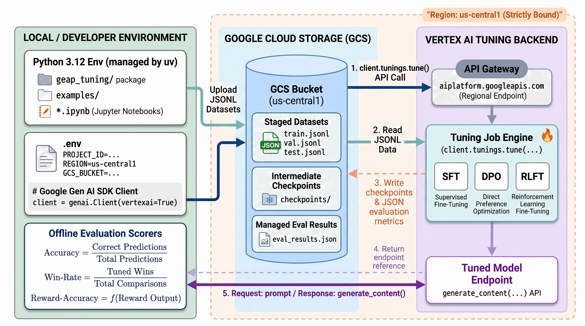
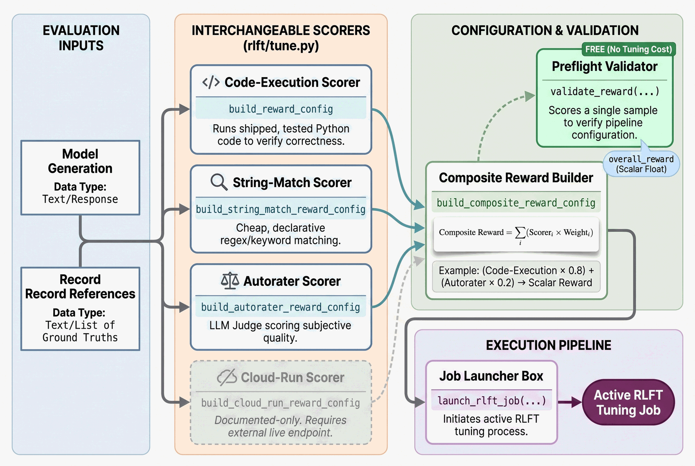

<div align="center">

<h1>🎛️ GEAP Tuning 🔧</h1>

<p>
<a href="https://www.python.org/"></a>
<a href="https://docs.astral.sh/uv/"></a>
<a href="https://docs.astral.sh/ruff/"></a>
<a href="https://github.com/astral-sh/ty"></a>
<a href="https://googleapis.github.io/python-genai/"></a>
<a href="https://cloud.google.com/vertex-ai"></a>
<a href="https://deepmind.google/technologies/gemini/"></a>
<a href="https://docs.pytest.org/"></a>
</p>

<p><em>Working, runnable examples of <b>Gemini Enterprise Agent Platform (GEAP)</b> model tuning services —<br><b>supervised fine-tuning (SFT)</b>, <b>preference tuning (DPO)</b>, and <b>reinforcement learning fine-tuning (RLFT)</b> —<br>built on the Google Gen AI SDK against the Vertex/Agent Platform backend.</em></p>



</div>

The `geap_tuning` package (uv-managed, Google Gen AI SDK, **regional** client)
stages JSONL datasets in a region-matched Cloud Storage bucket, then launches a
Vertex AI / GEAP tuning job whose method is SFT, DPO, or RLFT. The job produces a
**tuned model endpoint** plus per-epoch checkpoints and managed-evaluation results
in GCS; the package's offline scorers and inference call the returned endpoint.

## Setup

Requires [`uv`](https://docs.astral.sh/uv/) and Python 3.12+.

```bash
cp .env.example .env   # then fill in your GCP project, region, and bucket
make dev               # uv sync --all-groups
```

## Common commands

| Task | Command |
|------|---------|
| Install everything | `make dev` |
| Lint + format check + types | `make lint` |
| Auto-format | `make format` |
| Run tests | `make test` |
| Single test | `uv run pytest tests/test_smoke.py::test_main_runs` |
| Provision GCP resources | `./scripts/bootstrap_gcp.sh` (enables APIs + creates the region-matched bucket; idempotent, needs `gcloud auth login` first) |
| Run the SFT example | `uv run python examples/run_sft.py` (requires live GCP + incurs tuning cost) |
| Run the multimodal image SFT sweep | `uv sync --group vision && uv run python examples/run_sft_vision.py` (requires live GCP + a Kaggle token + incurs tuning cost) |
| Run the DPO example | `uv run python examples/run_preference.py` (requires live GCP + incurs tuning cost) |
| Run the RLFT example | `uv run python examples/run_rlft.py` (requires live GCP + incurs tuning cost) |
| Run the checkpointing demo | `uv run python examples/run_checkpoints.py` (requires live GCP + incurs tuning cost) |
| Run the continuous-tuning demo | `uv run python examples/run_continuous_tuning.py` (requires live GCP + incurs tuning cost) |
| Run the RLFT reward-types tour | `uv run python examples/run_rlft_reward_types.py` (requires live GCP + incurs tuning cost) |
| Run the advanced-evaluation demo | `uv run python examples/run_advanced_eval.py` (requires live GCP + incurs tuning cost) |

## Tuning services

GEAP exposes **three tuning methods** through the same `client.tunings.tune(...)`
call; they differ by *what they learn from*, and this repo implements one worked
example each. Checkpointing and continuous tuning layer on top of all three (they
are not separate services — see [Checkpointing & continuous tuning](#checkpointing--continuous-tuning)).

| Service | Learns from | Reach for it when… | Dataset record | Supported models | Example |
|---|---|---|---|---|---|
| **SFT** | labeled input→output examples | you can *demonstrate* the desired output (classification, extraction, summarization, domain queries); required for code models | gold `model` turn inside `contents` | 3.5 Flash · 3.1 Flash-Lite · 2.5 Pro · 2.5 Flash · 2.5 Flash-Lite | [`run_sft.py`](examples/run_sft.py) · [`01`](notebooks/01_sft.ipynb) |
| **DPO** (preference) | preference pairs (chosen vs rejected) | quality/style is *subjective* and hard to label; best after an SFT pass | `completions` — two candidates, `score` 1/0 | 2.5 Flash · 2.5 Flash-Lite only | [`run_preference.py`](examples/run_preference.py) · [`02`](notebooks/02_preference_tuning.ipynb) |
| **RLFT** | a programmable **reward** over generations | correctness/format/judge-score can be *scored* but not imitated (no single gold answer) | `references` (ground-truth map); **no** target completion | Pre-GA (`v1beta1`); docs recommend `gemini-3.5-flash` | [`run_rlft.py`](examples/run_rlft.py) · [`03`](notebooks/03_rlft.ipynb) |

- **Supervised fine-tuning (SFT)** teaches a new skill by imitating labeled
  `contents` (a user prompt plus a gold `model` turn). It's the go-to for
  well-defined tasks like classification, entity extraction, and summarization —
  and the *only* option for code models. The repo tunes `gemini-2.5-flash` and
  scores held-out **accuracy**.
- **Preference tuning (DPO)** learns *how* to answer from `completions` pairs
  scored preferred (`1`) / dispreferred (`0`) — use it for subjective style or
  quality that's hard to capture with a single label, ideally continuing from an
  SFT checkpoint (see [Checkpointing & continuous tuning](#checkpointing--continuous-tuning)).
  The repo passes `method="PREFERENCE_TUNING"` with a `beta` strength knob and
  scores **win-rate**; only Gemini 2.5 Flash / Flash-Lite support it.
- **Reinforcement learning fine-tuning (RLFT)** trains against a programmable
  reward over a `references` dataset with **no** target completion — reach for it
  when an objective can be *scored* (correctness, format, an LLM judge) rather
  than demonstrated. The repo passes `method="REINFORCEMENT_TUNING"` with a
  code-execution reward by default and scores **reward-accuracy**; the four
  reward-scorer types are toured in [RLFT reward types](#rlft-reward-types).
  RLFT is Pre-GA.

For exact call shapes, dataset JSONL schemas, and per-service hyperparameters see
[`docs/notes/tuning-apis.md`](docs/notes/tuning-apis.md) (`## Service matrix`);
for the full supported-model lists and the two-SDK-path choice see
[`docs/notes/geap-tuning-overview.md`](docs/notes/geap-tuning-overview.md).

## Workflow

Every example follows the same end-to-end lifecycle — only the record shape,
launcher, and reward/eval knobs change per method:


1. **Build the dataset** — JSONL records; the shape varies by method (SFT
   `contents`, DPO `completions` + `score`, RLFT `references` + a reward function).
2. **Stage in GCS** — `upload_file(...)` puts the train/val splits in the
   region-matched bucket.
3. **Preflight the reward** (RLFT only, free) — `validate_reward_config(...)`
   scores one sample before spending on a job.
4. **Launch the job** — a `launch_*_job(...)` wrapper around
   `client.tunings.tune(...)`; attach an `evaluation_config` and keep
   `export_last_checkpoint_only=False` so eval runs per checkpoint.
5. **Tune + evaluate** — GEAP emits one checkpoint per epoch and (if configured)
   evaluates each, writing results to GCS.
6. **Resolve the endpoint** — `wait_for_tuning_job(...)` returns the tuned model
   endpoint.
7. **Score offline + infer** — the repo's scorers (accuracy / win-rate /
   reward-accuracy) and `generate_content` call the endpoint.

The **continuous-tuning** loop feeds a tuned model back as `base_model` (the demo
chains **SFT → RLFT**), and **checkpoint reassignment** picks the best checkpoint
as the model's default — see below.

## Checkpointing & continuous tuning

Two cross-cutting sub-features layer on top of all three services (not separate
services). They're demonstrated by dedicated demos — `examples/run_checkpoints.py`
+ [`notebooks/04_checkpoints.ipynb`](notebooks/04_checkpoints.ipynb) and
`examples/run_continuous_tuning.py` +
[`notebooks/05_continuous_tuning.ipynb`](notebooks/05_continuous_tuning.ipynb) —
built on shared helpers in `geap_tuning.jobs` plus three keyword-only launcher
params (`export_last_checkpoint_only`, `evaluation_config`,
`pre_tuned_model_checkpoint_id`).

- **Checkpointing** — tune with `export_last_checkpoint_only=False` (the default)
  to keep one checkpoint per epoch, list them, run per-checkpoint inference, and
  reassign the model's default checkpoint.
- **Continuous tuning** — pass a prior tuned model's resource name as
  `base_model` to continue-tune from it; the demo chains **SFT → RLFT** on the
  same math domain and reports the accuracy lift.

See [`docs/notes/checkpoints-and-continuous-tuning.md`](docs/notes/checkpoints-and-continuous-tuning.md)
for the verified SDK surface and gotchas (Gen AI SDK only; auto-eval
`us-central1` only; base-model 2025-07-11 cutoff; tuning stays regional).

## RLFT reward types

RLFT scores each generation with a **reward function** over the record's
`references` — the scorer shape decides *how*. All four SDK scorers have builders
in [`rlft/tune.py`](src/geap_tuning/rlft/tune.py), toured by
`examples/run_rlft_reward_types.py` +
[`notebooks/06_rlft_reward_types.ipynb`](notebooks/06_rlft_reward_types.ipynb):



- **code-execution** (`build_reward_config`) — verifiable correctness; ships
  tested Python via `inspect.getsource` (the default reward).
- **string-match** (`build_string_match_reward_config`) — cheap, declarative
  format/keyword reward; no gold answer, no sandbox.
- **autorater** (`build_autorater_reward_config`) — an LLM judge scores subjective
  quality.
- **cloud-run** (`build_cloud_run_reward_config`) — external service; **documented
  builder only** (needs a deployed endpoint).

`build_composite_reward_config([(cfg, weight), ...])` combines several into a
weighted reward (e.g. code-exec 0.8 + autorater 0.2); pass it to `launch_rlft_job`
/ `validate_reward_config` as `composite_reward_config=` (mutually exclusive with
the single `reward_config`). Preflight any reward with `validate_reward_config`
before spending on a job.

## Multimodal (image) SFT

The SFT record shape is multimodal — a `user` turn can carry a `fileData` image
part (a `mimeType` + a `gs://` `fileUri`) alongside text. `geap_tuning.sft_vision`
demonstrates this with **oral-disease image classification**, ported from
[jswortz/dental-fine-tune-26](https://github.com/jswortz/dental-fine-tune-26):
`examples/run_sft_vision.py` +
[`notebooks/09_sft_vision.ipynb`](notebooks/09_sft_vision.ipynb).

- **Same tune call** — multimodal SFT differs from text SFT *only* in the records,
  so it reuses `launch_sft_job`; no new tune module.
- **Dataset** — Kaggle *Multi-Class Oral Disease Detection Dataset*
  (`singh868/multi-class-oral-disease-detection-dataset`, by Rahul Singh, **CC
  BY-SA 4.0**), auto-downloaded via the optional `vision` group (`kagglehub`,
  `uv sync --group vision`) using a `KAGGLE_API_TOKEN`. Images are staged to GCS;
  no image bytes are committed (only a tiny `sample.jsonl`).
- **Sweep → val-select → test** — trains two configs, evaluates each on the
  validation split, picks the best, scores the winner on the test split, and
  prints a comparison table.

See [`docs/notes/multimodal-sft.md`](docs/notes/multimodal-sft.md) for the record
shape, the GCS→local eval mapping, and cost knobs.

## Evaluation

GEAP exposes a managed **Gen AI Evaluation service**, and this repo pairs it with
its own **offline** scoring. They answer different questions — use both:


| | GEAP Evaluation service (managed) | Offline `evaluate.py` (this repo) |
|---|---|---|
| Runs where | Inside the tuning job, on GEAP | Locally, against the tuned endpoint |
| When | After each checkpoint, automatically | Whenever you call it, post-tuning |
| Metrics | LLM-as-judge / computation metrics from the eval catalog | Task-specific: SFT accuracy, DPO win-rate, RLFT reward accuracy |
| Output | JSONL/summary written to Cloud Storage | Python dict returned in-process |
| Availability | Preview, **`us-central1` only** | Anywhere |

### Using the managed Evaluation service

The service is reached **through the tuning call** — there is no standalone
`client.evals` surface in the Gen AI SDK (2.14.0). You attach an
`EvaluationConfig` to the job; GEAP then evaluates each exported checkpoint and
writes the results to GCS. Build the config with
[`geap_tuning.autoeval.build_evaluation_config`](src/geap_tuning/autoeval.py) and
pass it to any launcher's `evaluation_config` parameter:

```python
from geap_tuning.autoeval import build_evaluation_config
from geap_tuning.config import genai_client, load_config
from geap_tuning.sft.tune import launch_sft_job

cfg = load_config()  # location must be us-central1 for auto-eval
client = genai_client(cfg)

eval_config = build_evaluation_config(cfg.bucket, prefix="sft_eval")

job = launch_sft_job(
    client,
    train_uri=train_uri,
    val_uri=val_uri,
    display_name="geap-sft-support-intent",
    evaluation_config=eval_config,  # <- runs after each checkpoint
    export_last_checkpoint_only=False,  # keep checkpoints so each gets evaluated
)
```

Under the hood `build_evaluation_config` assembles the SDK types:

```python
types.EvaluationConfig(
    metrics=[
        types.Metric(
            name="FLUENCY", prompt_template="Evaluate the fluency of this response: {prediction}"
        )
    ],
    output_config=types.OutputConfig(
        gcs_destination=types.GcsDestination(output_uri_prefix="gs://<bucket>/sft_eval"),
    ),
)
```

- **Metrics** — mix three kinds, each with a builder in
  [`autoeval.py`](src/geap_tuning/autoeval.py) (see the comprehensive
  [`run_advanced_eval.py`](examples/run_advanced_eval.py) /
  [`07_advanced_eval`](notebooks/07_advanced_eval.ipynb)):
  - `llm_judge_metric(name, prompt_template, judge_model_system_instruction=)` —
    LLM-as-judge (`types.Metric`). **SDK lowercases `name`.**
  - `computation_metric(metric_type)` — deterministic `EXACT_MATCH`/`BLEU`/`ROUGE`
    (`types.UnifiedMetric`; no `name` field — the spec identifies it).
  - `predefined_metric(metric_spec_name)` — a managed catalog metric by name
    (e.g. `text_quality_v1`). **Verify names against the live catalog first.**

  Pass your own list to `build_evaluation_config(..., metrics=[...])`; the default
  is a single pointwise fluency metric as a starting point.
- **Autorater** — `build_autorater_config(sampling_count=, flip_enabled=,
  autorater_model=)` → `EvaluationConfig.autorater_config` tunes the shared judge
  (`flip_enabled` mitigates pairwise position bias).
- **Inference config** — `build_evaluation_config(..., inference_generation_config=
  types.GenerationConfig(temperature=0.0))` controls how the *tuned model*
  generates the responses being scored (deterministic → comparable across
  checkpoints).
- **Cadence** — SFT/DPO evaluate per exported checkpoint (cadence follows
  checkpointing). `evaluate_interval` (int) for explicit step-based cadence is
  **RLFT-only** in google-genai 2.14.0 — the SDK serializes it under the
  reinforcement spec, so it 400s on SFT/DPO jobs; it is threaded through
  `launch_rlft_job` only. See [docs/notes/tuning-apis.md](docs/notes/tuning-apis.md).
- **Results** — land under `output_uri_prefix` in Cloud Storage; view them there
  or in **Agent Platform Studio → Tune and Distill → _your tuned model_**.

> Auto-eval is Preview and available in **`us-central1` only**, so keep
> `GCP_REGION`/`GOOGLE_CLOUD_LOCATION` on `us-central1` when using it.

### Offline evaluation (complementary)

Each service ships a small, unit-tested offline scorer that runs against the
tuned endpoint and returns a metrics dict — used by the `examples/run_*.py`
drivers and notebooks:

- SFT — [`sft/evaluate.py`](src/geap_tuning/sft/evaluate.py) `run_eval` →
  `accuracy`, `macro_f1`, per-label `report`.
- DPO — [`preference/evaluate.py`](src/geap_tuning/preference/evaluate.py)
  `score_winrate` → `win_rate` + `wins`/`losses`/`ties`/`n`.
- RLFT — [`rlft/evaluate.py`](src/geap_tuning/rlft/evaluate.py) `run_rlft_eval`
  → `accuracy` + `correct`/`n`, reusing the training reward.

## Experiment tracking

GEAP tracks tuning experiments at two levels — one you get for free, one you opt into.

### 1. Built-in tuning metrics (automatic, no code)

Every Gemini tuning job launched here — SFT, DPO, and RLFT — automatically emits
training/validation metrics that stream to the Cloud console in real time. View them
under **Agent Platform Studio → Tune and Distill → _your tuned model_ → Monitor tab**.
The metric set depends on the method:

| Method | Training metrics | Validation metrics (only if a validation set is provided) |
|--------|------------------|-----------------------------------------------------------|
| SFT | `/train_total_loss`, `/train_fraction_of_correct_next_step_preds`, `/train_num_predictions` | `/eval_total_loss`, `/eval_fraction_of_correct_next_step_preds`, `/eval_num_predictions` |
| DPO (preference) | `/preference_optimization_train_loss` | `/eval_total_loss` |
| RLFT (reinforcement) | reward/loss curves over training steps | reward curves over the validation set |

This is why each launcher (`launch_sft_job`, `launch_preference_job`, `launch_rlft_job`)
accepts an optional `val_uri`: **passing a validation split is what unlocks the `/eval_*`
curves** — without it you only get the training curves. No SDK calls beyond launching the
job are needed; the metrics appear once the job starts running.

### 2. Vertex AI Experiments (opt-in, for comparing runs)

To compare *multiple* tuning runs — a hyperparameter sweep over `adapter_size`, `epochs`,
`learning_rate_multiplier`, or (RLFT) `samples_per_prompt` — and to record your own offline
eval numbers (e.g. the held-out accuracy from `run_eval`) alongside each run, log to a
**Vertex AI Experiment** via the [`experiments`](src/geap_tuning/experiments.py) helper. It
wraps `google-cloud-aiplatform` (already a dependency), *complementing* the `google.genai`
tuning call — Experiments is orchestration around the job, so mixing the two SDKs here is
intentional, not a violation of the "one SDK path per example" rule (see [CLAUDE.md](CLAUDE.md)).

```python
from geap_tuning.experiments import init_experiment, track_run, log_summary_metrics

init_experiment("geap-sft-checkpoint-eval", project=cfg.project, location=cfg.location)
with track_run("v1-adapter16", params={"base_model": "gemini-2.5-flash", "adapter_size": 16}):
    log_summary_metrics({"accuracy": metrics["accuracy"], "macro_f1": metrics["macro_f1"]})
```

`init_experiment` selects the experiment context; each `track_run(...)` is one trackable run
that logs its params on entry, and `log_summary_metrics` records one value per key. Read the
runs back as a table with `experiment_dataframe("geap-sft-checkpoint-eval")` or compare them
in **console → Experiments**. **Summary metrics need no TensorBoard**; longitudinal
*time-series* curves (`log_timeseries_metrics`) additionally require a **Managed TensorBoard**
instance (cost + provisioning), created/attached opt-in via `get_or_create_tensorboard(...)` +
`init_experiment(..., tensorboard=...)`. Experiment runs themselves incur no extra charge —
you pay only for the tuning/eval resources they wrap.

A complete worked example (reuses one SFT-with-checkpoints job, logs a run per checkpoint,
optional `--tensorboard` time-series) is in
[`examples/run_experiment_tracking.py`](examples/run_experiment_tracking.py) /
[`notebooks/08_experiment_tracking.ipynb`](notebooks/08_experiment_tracking.ipynb). See
[`docs/notes/experiment-tracking.md`](docs/notes/experiment-tracking.md) for the full API
surface, the automatic-vs-opt-in split, and gotchas.

## Conventions

Read [CODE_STANDARDS.md](CODE_STANDARDS.md) before writing code or changing the environment. Session notes live in [`docs/notes/`](docs/notes/README.md); guidance for AI agents is in [CLAUDE.md](CLAUDE.md).

## Repo structure

```text
geap-tuning/
├── src/geap_tuning/             # the package — shared helpers: config, gcs, jobs,
│   │                            #   autoeval, inference, schemas
│   ├── sft/                     # supervised fine-tuning (data, tune, evaluate)
│   ├── sft_vision/              # multimodal (image) SFT — oral-disease classification
│   ├── preference/              # preference tuning / DPO
│   └── rlft/                    # reinforcement learning fine-tuning + reward builders
├── examples/                    # runnable run_*.py drivers (one per demo; live GCP + cost)
├── notebooks/                   # thin 01–09 notebooks mirroring the examples
├── tests/                       # pytest suite — mocked clients, no live GCP
│   ├── sft/
│   ├── sft_vision/
│   ├── preference/
│   └── rlft/
├── datasets/                    # JSONL datasets (gitignored; a sample.jsonl is committed)
│   ├── sft_support_intent/
│   ├── preference_support_style/
│   ├── rlft_math/
│   └── math_sft/
├── docs/
│   ├── notes/                   # durable session notes (indexed by notes/README.md)
│   └── imgs/                    # reference-architecture + workflow diagrams
├── scripts/                     # bootstrap_gcp.sh — enable APIs + create the region bucket
├── CLAUDE.md                    # guidance for AI agents
├── CODE_STANDARDS.md            # uv / ruff / ty / pytest non-negotiables
├── Makefile                     # dev · lint · format · test
├── pyproject.toml               # dependencies + tool config
└── uv.lock                      # pinned dependency lockfile
```
