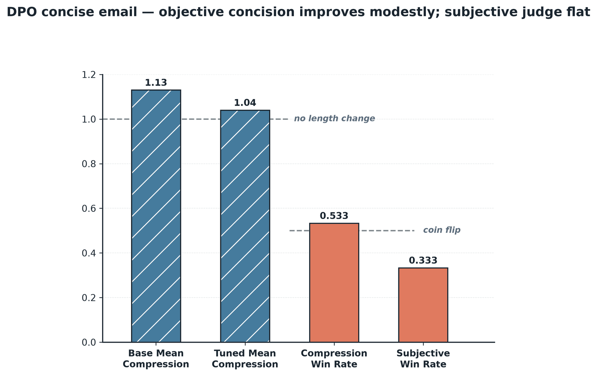

# DPO concise-email DOE (objective concision, before → after)

**Question:** on a concise professional-email rewriting task, does preference tuning
(DPO) make a strong base *more concise* — and does the subjective quality judge
reward it?

This is a one-factor before → after experiment (factor = tuning on/off, with the DPO
knobs fixed at `epochs=3`, `beta=0.2`), not a hyperparameter grid. It earns a place in
this folder because it answers a design question the way the reward-shape sweeps do:
**which axis does DPO actually move on a strong modern base?**

- **Example:** [`examples/run_preference_email.py`](../../../examples/run_preference_email.py)
- **Notebook:** [`notebooks/18_preference_email.ipynb`](../../../notebooks/18_preference_email.ipynb)
- **Modules:** [`preference/email.py`](../../../src/geap_tuning/preference/email.py), [`preference/email_eval.py`](../../../src/geap_tuning/preference/email_eval.py)
- **Design narrative:** [`../../notes/generative-tuning-domains.md`](../../notes/generative-tuning-domains.md)

## The metric pivot that makes this honest

The obvious headline — a blind A/B autorater `win_rate` — **saturates**: a strong base
already out-writes hand-authored gold ~87% of the time *while expanding the draft*. So
the headline was pivoted to the **objective axis the preference pairs actually train**:

- `mean_compression` — rewrite/draft word ratio (`< 1` = shorter, `1.0` = no change).
- `compression_win_rate` — fraction of drafts where the tuned rewrite is *strictly
  shorter* than the base rewrite (a binomial rate → takes `bootstrap_ci`).

The subjective judge `win_rate` rides along as a **secondary** "what DPO doesn't move"
signal. The judge prompt is distinct from the generator's system instruction, blind,
and both preference completions carry the same facts, so it grades style not content. A
pilot gate refuses to spend unless base `mean_compression >= 0.9` (real concision
headroom); here the base sits at ~1.12 (it *expands* drafts), so the gate passes.

## How to run

```bash
uv run python examples/run_preference_email.py   # pilot gate, then tune, then before→after
```

Reruns are **idempotent** — the job is reused by display name
(`geap-dpo-concise-email-v2`), so a re-run only re-scores the existing endpoint.

## Results

> **Status: complete.** Job `SUCCEEDED` (`gemini-2.5-flash`, `us-central1`,
> `epochs=3`, `beta=0.2`). Scored on a held-out split of **n = 15**; pilot gate passed
> (base `mean_compression = 1.12 ≥ 0.9`).

| Metric | Base | Tuned | Read |
|---|---|---|---|
| **`mean_compression`** (headline; lower = shorter) | 1.13 | **1.04** | base expands +13% → tuned +4% |
| `compression_win_rate` (tuned strictly shorter than base) | — | 0.533 (8/15) | CI [0.267, 0.800] — a coin flip at n=15 |
| subjective judge `win_rate` (secondary) | — | 0.333 | judge still prefers the verbose base |



### Read this honestly — a modest gain on the trained axis, and nothing else

DPO moved the exact axis it trains — `mean_compression` fell from `1.13` (the base
*expands* drafts by 13%) to `1.04` (tuned is nearly length-neutral) — but **weakly**:

- The per-draft "strictly shorter than base" rate is `0.533`, with a 95% CI of
  `[0.267, 0.800]` that straddles `0.5`; at `n = 15` it is not distinguishable from a
  coin flip. The **mean** shifts in the right direction; the **per-item win** does not
  reach significance at this sample size.
- The subjective judge `win_rate` stays at `0.333` — the judge, which a strong base
  already saturates, does **not** reward the added concision.

**Takeaway:** on a strong modern base, DPO nudges the objective it is trained on
directionally, while the subjective axis the base already dominates does not move — so
report the objective axis (with a CI) as the headline, and keep the subjective judge
only as the honest "what DPO doesn't move" control. This is the DPO instance of the
recurring theme across these demos: modern bases leave thin, uneven headroom (compare
the [SFT convention DOE](../sft-extraction-convention/README.md) and the RLFT nulls).
