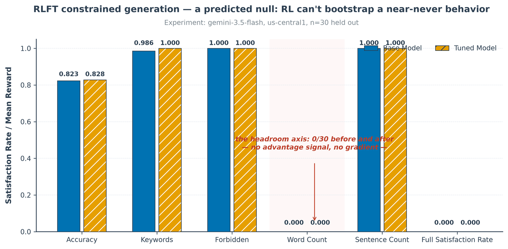

# RLFT constrained-generation DOE (graded reward, before → after)

**Question:** with a **graded** reward (fraction of constraints satisfied) engineered
to fix the two prior RLFT nulls, can reinforcement tuning close a real, measured
headroom on a strong base?

This is a one-factor before → after experiment (factor = tuning on/off) on
`gemini-3.5-flash`, gated by a pilot headroom check. It belongs alongside the two
reward-shape sweeps because it is the **third** attempt to get RLFT to move a metric on
this model — and it produces a **third, predicted null**, which is the finding.

- **Example:** [`examples/run_rlft_constrained.py`](../../../examples/run_rlft_constrained.py)
- **Notebook:** [`notebooks/19_rlft_constrained.ipynb`](../../../notebooks/19_rlft_constrained.ipynb)
- **Modules:** [`rlft/constrained.py`](../../../src/geap_tuning/rlft/constrained.py), [`rlft/constraint_reward.py`](../../../src/geap_tuning/rlft/constraint_reward.py), [`rlft/constraint_eval.py`](../../../src/geap_tuning/rlft/constraint_eval.py)
- **Design narrative:** [`../../notes/generative-tuning-domains.md`](../../notes/generative-tuning-domains.md)

## The design that answers the two prior nulls

Each prompt spells out four constraint types at once (required keywords, forbidden
words, an exact word count, an exact sentence count). The reward is the **fraction** of
independently-checked components satisfied — each keyword and each forbidden word is its
own component; the word-count and sentence-count targets are one component each. That
graded shape is deliberate:

- **Variance** — fractional credit gives a non-degenerate reward even for a mediocre
  rollout, fixing the [reward-shapes](../rlft-reward-shapes/README.md) zero-gradient
  null.
- **Headroom** — satisfying four constraint types at once is hard even for a strong
  base, fixing the saturation null.

The reward module is stdlib-only and ships verbatim to the GEAP sandbox via
`build_reward_config("constraint_satisfaction", module=constraint_reward)`. A pilot gate
(`--pilot-only`) refuses to spend unless base `accuracy < 0.85`; switching the count
constraints from *bands* to *exact targets* dropped the base from `0.992` to `0.823`
and localized all the headroom to exact `word_count` (0/30), so the gate passed.

## How to run

```bash
uv run python examples/run_rlft_constrained.py --pilot-only   # free headroom gate
uv run python examples/run_rlft_constrained.py                # gate, then tune, then before→after
```

## Results

> **Status: complete.** Job `SUCCEEDED` (`gemini-3.5-flash`, `us-central1`, ~53 min),
> scored on a held-out split of **n = 30**, replaying each record's training system
> instruction; `bootstrap_ci` on the full-satisfaction rate.

| Component | Base | Tuned | Δ |
|---|---|---|---|
| `accuracy` (mean graded reward) | 0.823 | 0.828 | +0.006 |
| `keywords` | 0.986 | 1.000 | +0.014 |
| `forbidden` | 1.000 | 1.000 | — |
| **`word_count`** (the headroom axis) | 0.000 (0/30) | 0.000 (0/30) | **—** |
| `sentence_count` | 1.000 | 1.000 | — |
| `full_satisfaction_rate` | 0.000 (CI [0,0]) | 0.000 (CI [0,0]) | — |



### Read this honestly — a third, predicted null

The graded reward worked as designed — it delivered variance (the base's graded
`accuracy` was `0.82`, not `0.00`) and the pilot gate found real headroom. But RLFT
still **could not close it**:

- The **only** component that moved was `keywords` (`0.986 → 1.000`) — a behavior the
  base already emitted ~99% of the time, which RL simply amplified to 100%.
- The exact `word_count` axis — the sole real headroom — stayed at **0/30 before *and*
  after**, so `full_satisfaction_rate` never left `0.000`.

**Root cause (the same mechanism as the [reward-ranking](../rlft-reward-ranking/README.md)
marker null):** an *exact* word count has a ~0% base rate, so nearly every rollout earns
the same word-count reward → no advantage signal → no gradient. **RL amplifies
behaviors the base sometimes produces; it cannot bootstrap a near-never behavior without
an SFT warm-start first.** The reward design is sound and the pilot gate correctly
identified real (but, as it turns out, un-RL-reachable) headroom — the null is a genuine
property of reinforcement tuning, not a flaw in the experiment. It is the RLFT bookend
to the [SFT convention DOE](../sft-extraction-convention/README.md), where SFT *has* the
gradient signal yet a strong prior still blocks one field.
