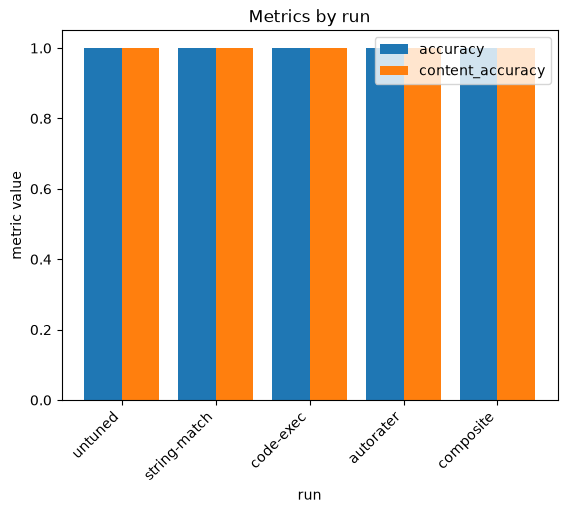

# RLFT reward-shape DOE

**Question:** for the same verifiable-math task, which **reward function** produces
the most accurate tuned model?

Every other DOE in this repo sweeps tuning *hyperparameters*. This one sweeps the
axis unique to RLFT and arguably its most consequential design choice — the
**reward** itself — tuning `gemini-3.5-flash` once per reward shape on the same
dataset and scoring every result on the same held-out split against an **untuned
baseline**, so the before→after lift is explicit.

- **Example:** [`examples/run_doe_rlft_rewards.py`](../../../examples/run_doe_rlft_rewards.py)
- **Notebook:** [`notebooks/15_doe_reward_types.ipynb`](../../../notebooks/15_doe_reward_types.ipynb)
- **Experiment:** `geap-doe-rlft-rewards`
- **Framework mechanics:** [`../../notes/doe-and-visualization.md` → "Sweeping the reward *shape* (RLFT)"](../../notes/doe-and-visualization.md#sweeping-the-reward-shape-rlft)

## The four reward shapes

| Label | `sweep.fixed` payload | What it rewards |
|---|---|---|
| `string-match` | `build_string_match_reward_config()` | the declarative `Answer:\s*-?\d+` **format** (no sandbox) |
| `code-exec` | `build_reward_config()` | **correctness** — ships `geap_tuning.rlft.reward` to the sandbox |
| `autorater` | `build_autorater_reward_config(autorater_model=…)` | **explanation quality**, graded by an LLM judge |
| `composite` | `build_composite_reward_config([(code-exec, 0.8), (autorater, 0.2)])` | correctness (0.8) + quality (0.2) |

The autorater judge needs a **fully-qualified** publisher path
(`projects/<p>/locations/<l>/publishers/google/models/gemini-2.5-flash`); a bare
model name fails with an opaque reward error.

## Why this needs no `doe.py` change

A reward config is a non-scalar object, so it **cannot be a grid axis** (grid
values feed the run slug and Experiments params, which must be scalars). Following
`run_doe_rlft.py`, each reward rides in `sweep.fixed`, where `doe._scalar_params`
keeps it out of the slug, rows, and Experiments params. So each shape becomes its
own **single-run `SweepConfig`** (empty grid → one run), all logged to one shared
Experiment; the driver combines them under **labels it controls**, because every
empty-grid `RunSpec.name` is `"default"` and would otherwise collide.

## How to run

```bash
# run + print the cross-reward table (four RLFT jobs; incurs tuning cost)
uv run python examples/run_doe_rlft_rewards.py

# same, plus write metrics.png into this folder (needs the viz group)
uv run --group viz python examples/run_doe_rlft_rewards.py --plot
```

Reruns are **idempotent** — jobs are reused by display name
(`geap-doe-rew-<shape>-default`), so re-running only launches shapes that don't
already have a finished job.

### Operational gotchas (learned live)

- **Metric semantics.** The headline `accuracy` is the fraction of held-out
  problems the tuned model answers **correctly** (offline correctness scorer,
  reward > 0). A `string-match` model that nails the *format* but not the *math*
  will therefore score low — that is the finding, not a bug.
- **Tuned-endpoint location.** A tuned Gemini 3.x model is deployed to the `us`
  (or `eu`) **multi-region** endpoint, not the `us-central1` region the job ran
  in. Inference must target the endpoint's own location or it 404s — the example
  uses `config.genai_client_for_endpoint(cfg, endpoint)`. See
  [`../../notes/environment.md`](../../notes/environment.md).
- **Baseline routing.** The untuned baseline is scored through a separate
  `global`-routed inference client (Gemini 3.x base-model inference is
  `global`-only), distinct from the regional tuning client.

## Results

> **Status: pending.** Live run in progress (started 2026-07-31). Jobs run
> sequentially — `string-match` (reused) ✅, `code-exec` (running), then
> `autorater` and `composite`. `autorater`/`composite` use an LLM-judge reward and
> are the slow ones. This section will be filled with the final table, the
> `metrics.png` chart, and the takeaway once all four jobs complete.

| Reward shape | Held-out accuracy | vs. untuned |
|---|---|---|
| untuned baseline | _pending_ | — |
| `string-match` | _pending_ | _pending_ |
| `code-exec` | _pending_ | _pending_ |
| `autorater` | _pending_ | _pending_ |
| `composite` | _pending_ | _pending_ |

<!--  -->

**Best reward shape:** _pending._
