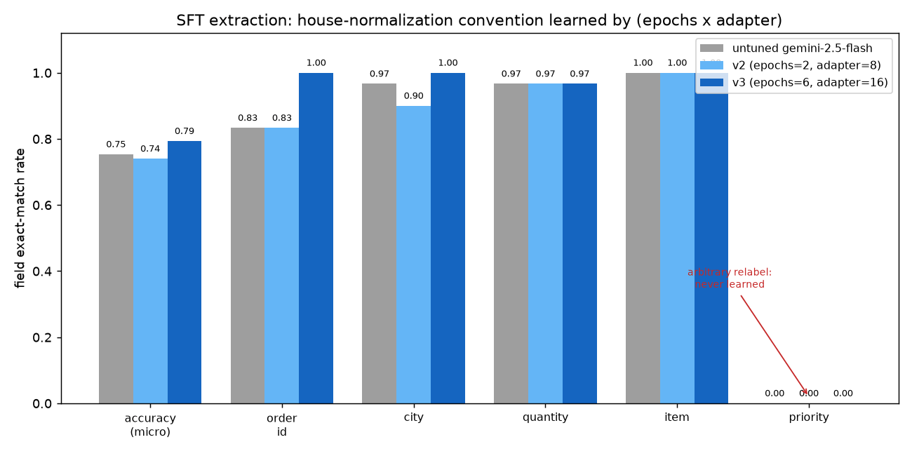

# SFT convention-teaching DOE (epochs × adapter)

**Question:** can supervised fine-tuning teach a **house normalization standard the
base cannot guess**, and does scaling `epochs × adapter_size` change *which*
conventions it learns?

Unlike the reward-shape sweeps in this folder, this DOE varies the two SFT capacity
knobs — training `epochs` and LoRA `adapter_size` — on the generative JSON-extraction
task, and reads the effect **per convention** (not just the micro-average). It is the
one DOE here that both **discriminates** (a real lift) and **dissociates** (the lift
is confined to certain fields), which is what makes it instructive.

- **Task / example:** [`examples/run_sft_extraction.py`](../../../examples/run_sft_extraction.py)
- **Notebook:** [`notebooks/17_sft_extraction.ipynb`](../../../notebooks/17_sft_extraction.ipynb)
- **Dataset + eval:** [`sft/extraction.py`](../../../src/geap_tuning/sft/extraction.py), [`sft/extraction_eval.py`](../../../src/geap_tuning/sft/extraction_eval.py)
- **Design narrative:** [`../../notes/generative-tuning-domains.md`](../../notes/generative-tuning-domains.md)

## The task and its conventions

Plain field extraction saturates a modern base (`accuracy=1.000` in a live run), so
the gold object applies an **internal normalization standard** the raw order line
never reveals. `SYSTEM_INSTRUCTION` *signals a standard applies* but never spells out
the mapping — SFT must learn it from labels. Four conventions, deliberately of two
different kinds:

| Field | Convention | Kind |
|---|---|---|
| `order_id` | strip `ord-` prefix, upper-case (`ord-g8850` → `G8850`) | deterministic **rule** |
| `quantity` | integerize spelled-out counts (`a dozen` → `12`) | deterministic **rule** |
| `city` | expand abbreviation (`PHL` → `Philadelphia`) | **lookup the base half-knows** |
| `priority` | map urgency word to a P-code (`urgent` → `P0`) | **fully-arbitrary relabel** |

A pilot gate (`--pilot-only`) scores the untuned base for free and refuses to tune
above `SAT_CEILING=0.85`; the base sits at ~0.75 (headroom localized to `priority`
and `order_id`), so the gate passes.

## The sweep

Two live tunes on `gemini-2.5-flash` (`us-central1`), plus the untuned baseline. Both
tuned the same dataset; only the capacity knobs changed. This is a small,
deliberately-chosen two-cell design (a null cell and a lift cell), not a full grid —
`v2` was launched first, showed no lift, and motivated the stronger `v3`.

| Run | `epochs` | `adapter_size` | Display name |
|---|---|---|---|
| untuned | — | — | (base `gemini-2.5-flash`) |
| v2 | 2 | 8 | `geap-sft-json-extraction-v2` |
| v3 | 6 | 16 | `geap-sft-json-extraction-v3` |

## How to run

```bash
uv run python examples/run_sft_extraction.py --pilot-only   # free headroom gate
uv run python examples/run_sft_extraction.py                # gate, then tune v3 (epochs=6/adapter=16)
```

Reruns are **idempotent** — the job is reused by display name, so a re-run only
re-scores the existing endpoint. To reproduce `v2`, set `EPOCHS=2`/`ADAPTER_SIZE=8`
and `DISPLAY_NAME="…-v2"` in the driver.

## Results

> **Status: complete.** Both jobs `SUCCEEDED` (`gemini-2.5-flash`, `us-central1`).
> All three rows below were scored **in one pass on the same held-out split**
> (n = 30) replaying the training `SYSTEM_INSTRUCTION`, so the baseline is shared and
> the columns are directly comparable (an earlier per-run baseline drifted ±0.03 from
> generation sampling noise — the *signal* is robust to it).

| Field | Convention kind | untuned | v2 (2/8) | v3 (6/16) |
|---|---|---|---|---|
| **`accuracy`** (micro) | — | 0.753 | 0.740 | **0.793** |
| `order_id` | rule | 0.833 | 0.833 | **1.000** |
| `city` | lookup base half-knows | 0.967 | 0.900 | **1.000** |
| `quantity` | rule | 0.967 | 0.967 | 0.967 |
| `item` | verbatim copy | 1.000 | 1.000 | 1.000 |
| **`priority`** | **arbitrary relabel** | **0.000** | **0.000** | **0.000** |



### Read this: SFT learns rule-based conventions, resists an arbitrary relabel

The DOE **does** discriminate — but only along one dimension of capacity, and only
for one class of convention:

- **v2 (epochs=2, adapter=8) does nothing.** Micro accuracy `0.740` is within noise of
  the untuned `0.753`; no field improves. Two epochs at rank-8 is too few gradient
  steps to move even the learnable conventions.
- **v3 (epochs=6, adapter=16) lifts the *aligned* conventions to perfect.** `order_id`
  `0.833 → 1.000` and `city` `0.967 → 1.000` — the deterministic string transform and
  the abbreviation lookup the base already half-knew. This is the entire `+0.040`
  micro-accuracy gain.
- **`priority` never moves — `0.000` across all three runs.** The fully-arbitrary
  `urgent`→`P0` map is not learned even at 3× epochs / 2× adapter. A direct endpoint
  probe confirms this is **not** under-fit: the v3 model applies every rule-based
  transform but **never emits a single P-code**, echoing the raw urgency word
  (`high`, `Low`, `normal`) and in one case even relabeling `urgent`→`high`. The
  base's strong semantic prior ("`urgent` is a priority word") overrides the opaque
  code, and reachable LoRA capacity does not dislodge it.

**Methodology takeaway.** Report **per-field**, not just the micro-average: a single
`0.753 → 0.793` headline hides the real story, which is a *dissociation* — capacity
crosses a threshold for conventions that align with the model's generalization
(rules, near-known lookups), while an arbitrary categorical relabel is resisted
regardless. This is the SFT-side mirror of the two RLFT nulls in this folder
([reward-shapes](../rlft-reward-shapes/README.md),
[reward-ranking](../rlft-reward-ranking/README.md)): RLFT lacks the gradient signal to
teach a from-scratch behavior; SFT *has* the signal here yet a strong prior still wins
on one field. In both cases the honest finding is *which* behaviors tuning will and
won't move on a strong modern base — a more useful result than a clean leaderboard.
