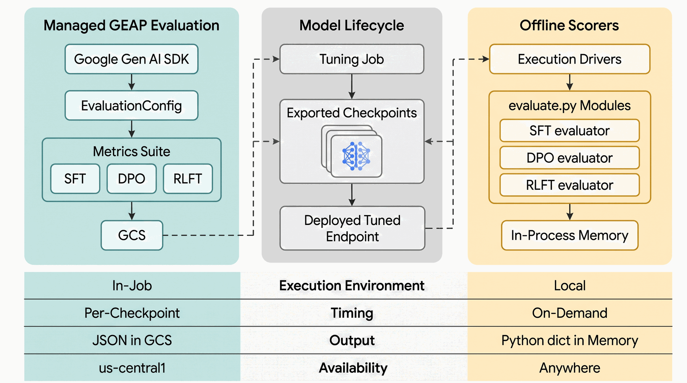

# GEAP Tuning APIs — call shapes, dataset schemas, hyperparameters

Durable reference for the three GEAP tuning services. Verified 2026-07-28.
Re-verify SDK symbols and base-model strings before acting — this surface moves.
See [[environment]] for config/auth and [[toolchain]] for tooling.

## Service matrix

| Service | Launch call | Dataset extra fields | Key hyperparameters | SDK maturity |
|---|---|---|---|---|
| **SFT** | `client.tunings.tune(base_model, training_dataset, config)` | none (just `contents`) | `epoch_count`, `adapter_size`, `learning_rate_multiplier` | GA, Gen AI SDK |
| **Preference (DPO)** | same `tunings.tune(...)` + `method="PREFERENCE_TUNING"` | `completions` list with `score` (0/1) | above + `beta` | GA, Gen AI SDK |
| **RLFT** | same `tunings.tune(...)` + `method="REINFORCEMENT_TUNING"` | `references` (no target completion) | `reward_config` + `samples_per_prompt` | Pre-GA, Gen AI SDK |

The launch method is **`tune`**, not `create`. Construct the Vertex-backed
client with `genai.Client(vertexai=True, project=..., location=...)`.

## Dataset JSONL schemas (all share the `contents` base)

Base record (SFT) — one user turn + the ground-truth model turn:

```json
{"contents": [
  {"role": "user",  "parts": [{"text": "..."}]},
  {"role": "model", "parts": [{"text": "..."}]}
], "systemInstruction": {"parts": [{"text": "..."}]}}
```

`systemInstruction` is optional. Multimodal parts use
`{"fileData": {"mimeType": "...", "fileUri": "gs://..."}}` (see
`schemas.file_part`).

**DPO** adds a `completions` array of candidate responses, each with a binary
`score` (1 = preferred, 0 = not). **RLFT** drops the target model turn entirely
(`contents` ends on the user turn) and adds a `references` string→string dict of
ground-truth metadata that the **reward function** reads to score generations —
there is no gold answer to match. See the RLFT section below for the full shape.

## SFT hyperparameters (this repo's `launch_sft_job`)

- `epoch_count` — default 2 here; small datasets overfit past a few epochs.
- `adapter_size` — LoRA rank; enum `ADAPTER_SIZE_{ONE,TWO,FOUR,EIGHT,SIXTEEN}`
  (map in `sft/tune.py:ADAPTER_MAP`). Larger = more capacity + cost + overfit risk.
- `learning_rate_multiplier` — scales the default LR.
- `validation_dataset` — optional `TuningDataset(gcs_uri=...)`.

Config object: `types.CreateTuningJobConfig(...)`;
datasets: `types.TuningDataset(gcs_uri=...)`.

## DPO (preference tuning) record + hyperparameters

Implemented in `preference/` (`launch_preference_job`, builders in
`schemas.preference_example`). Same `client.tunings.tune(...)` as SFT — both
`method="PREFERENCE_TUNING"` **and** `beta` are fields on
`types.CreateTuningJobConfig` (verified against the installed SDK, not assumed).

Record shape — `contents` ends on a **user** turn (no gold model turn); the pair
of scored responses lives in `completions`:

```json
{
  "contents": [{"role": "user", "parts": [{"text": "..."}]}],
  "completions": [
    {"score": 1, "completion": {"role": "model", "parts": [{"text": "<preferred>"}]}},
    {"score": 0, "completion": {"role": "model", "parts": [{"text": "<dispreferred>"}]}}
  ],
  "systemInstruction": {"parts": [{"text": "..."}]}
}
```

- `score` is binary: **1 = preferred, 0 = dispreferred**; exactly one of each.
  Only the `completions` turns are trained on. `systemInstruction` optional.
- **Text-only** — DPO does not support multimodal parts.
- `beta` — recommended **0.01–0.5**; lower = more aggressive updates toward the
  preferred response, `0` = no learning. All the SFT hyperparameters above
  (`epoch_count`, `adapter_size`, `learning_rate_multiplier`, `validation_dataset`)
  also apply.
- **Supported base models:** Gemini 2.5 Flash / 2.5 Flash-Lite.
- **Best practice:** SFT on the preferred responses first, then *continuous-tune*
  from that checkpoint with DPO. This repo's demo tunes the base model directly to
  stay self-contained.
- **Eval:** no single gold label → autorater pairwise **win-rate** (tuned reply
  vs. the dispreferred reference in a blind A/B judgment); see
  `preference/evaluate.py`.

## RLFT (reinforcement tuning) record + hyperparameters

Implemented in `rlft/` (`launch_rlft_job`, builders in `schemas.rlft_example`).
Same `client.tunings.tune(...)` as SFT/DPO — `method` is passed as the **string**
`"REINFORCEMENT_TUNING"` (the `TuningMethod` enum only lists SFT/PREFERENCE/
DISTILLATION, but the SDK is case-insensitive; confirmed by the SDK's own
`tests/tunings/test_tune.py`). `reward_config` (and `composite_reward_config`,
`samples_per_prompt`, `thinking_level`, `evaluate_interval`, `checkpoint_interval`,
`max_output_tokens`, `batch_size`) are fields on `types.CreateTuningJobConfig`
(verified against the installed `google-genai` 2.14.0, not assumed).

Record shape — `contents` ends on a **user** turn; ground truth lives in
`references` (a string→string dict), and there is **no** completion:

```json
{
  "systemInstruction": {"parts": [{"text": "..."}]},
  "contents": [{"role": "user", "parts": [{"text": "What is 17 * 23? End with 'Answer: <number>'."}]}],
  "references": {"ground_truth_answer": "391"}
}
```


- **Reward scorers** — one of four on `SingleReinforcementTuningRewardConfig`
  (`reward_name` + exactly one scorer). All four have builders in `rlft/tune.py`
  (`build_*_reward_config`); demoed by `examples/run_rlft_reward_types.py` /
  `06_rlft_reward_types`:
  - `code_execution_reward_scorer` (`python_code_snippet`) — verifiable
    correctness; ships `rlft/reward.py` verbatim (the default).
  - `string_match_reward_scorer` (`correct_answer_reward`, `wrong_answer_reward`,
    `string_match_expression{match_operation: MatchOperation[REGEX_CONTAINS|
    PARTIAL_MATCH|EXACT_MATCH], expression}`; alt. `json_match_expression{key_name,
    value_string_match_expression}` to match a `references` key) — cheap,
    declarative format/keyword reward, no gold, no sandbox.
  - `autorater_scorer` (`autorater_config: AutoraterConfig`, `autorater_prompt`,
    `autorater_response_parse_config{parse_type: ResponseParseType[IDENTITY|
    REGEX_EXTRACT], regex_extract_expression}`, and one of
    `exact_match_scorer{correct_answer_reward, wrong_answer_reward, expression}` /
    `parsed_response_conversion_scorer`) — LLM judge for subjective quality.
  - `cloud_run_reward_scorer` (`cloud_run_uri`) — external service; **documented
    builder only** here (needs a deployed endpoint).
  - `CompositeReinforcementTuningRewardConfig.weighted_reward_configs` — list of
    `…WeightedRewardConfig{reward_config: SingleReinforcementTuningRewardConfig,
    weight: float}`; the reward is the weighted sum (e.g. code-exec 0.8 +
    autorater 0.2).
- **Code-execution contract** — the sandbox runs `python_code_snippet`, then calls
  `evaluate(example, response) -> float` with **camelCase ProtoJSON** dicts
  (`example` carries `references`/`systemInstruction`; `response` is a `Content`
  with `parts`). Rewards are **clipped to `[-1, 1]`**. The snippet must be
  **self-contained** (stdlib + numpy/pandas/sympy in the sandbox, no repo imports).
  A job **auto-stops if >80%** of reward calls error or return `NaN`. This repo
  ships `rlft/reward.py` verbatim via `inspect.getsource` — one tested function
  used both as the training reward and for offline eval.
- **Preflight** — `client.tunings.validate_reward(parent, sample_response, example,
  single_reward_config=... | composite_reward_config=...)` scores one example
  before launch; a non-null `error` or `NaN` means the reward is broken. Both
  `launch_rlft_job` and `validate_reward_config` accept a mutually-exclusive
  `composite_reward_config=` (`rlft/tune.py`).
- **Hyperparameters** — `samples_per_prompt` (candidate generations per prompt for
  reward comparison), plus `epoch_count`, `adapter_size`, `learning_rate_multiplier`,
  `validation_dataset` as with SFT; `thinking_level` (`HIGH`/`MINIMAL`).
- **Limits (docs):** ≤5,000 train / ≤500 val examples, ≤32,768 input/output tokens.
- **Supported base model / regions:** docs specify `gemini-3.5-flash`; tuning in
  `us-central1` / `europe-west4`; `v1beta1`. This repo's launcher defaults to
  `gemini-2.5-flash` for consistency but documents the `gemini-3.5-flash`
  recommendation — verify availability before running live.
- **Best practice:** SFT first, then *continuous-tune* with RLFT. This repo's demo
  tunes the base model directly to stay self-contained.
- **Eval:** no gold label → reuse the reward. Generate per held-out prompt, score
  with the same `evaluate`, report fraction with positive reward (accuracy); see
  `rlft/evaluate.py`.

## Job lifecycle → endpoint

- States: `JOB_STATE_{PENDING,RUNNING,SUCCEEDED,FAILED,CANCELLED}` (constants in
  `jobs.py`). Poll `client.tunings.get(name=...)`; reuse by display name via
  `client.tunings.list()` for cost control.
- Output is an **endpoint**: `job.tuned_model.endpoint` (fall back to
  `.model`). Call `client.models.generate_content(model=endpoint, ...)`.
- For thinking models, disable thinking (`thinking_budget=0`) on the tuned
  endpoint — SFT trains direct ground-truth output, so a trace only adds cost.

## Checkpointing & continuous tuning (cross-cutting, implemented)

Both are sub-features of the three services above, demonstrated by dedicated
demos (`04_checkpoints`, `05_continuous_tuning`) via shared helpers in `jobs.py`
and three keyword-only launcher params (`export_last_checkpoint_only`,
`evaluation_config`, `pre_tuned_model_checkpoint_id`; RLFT also
`checkpoint_interval`). Continuous tuning needs no base-model plumbing — pass a
tuned-model resource name as `base_model` and the SDK treats it as pre-tuned.
Full verified surface + gotchas (auto-eval `us-central1` only, 2025-07-11
base-model cutoff, Gen AI SDK only) in
[[checkpoints-and-continuous-tuning]].

## Managed evaluation (cross-cutting, implemented)

Reached **only via `CreateTuningJobConfig.evaluation_config`** — there is no
standalone `client.evals` in google-genai 2.14.0. GEAP evaluates each checkpoint
and writes results to GCS. Builders in `autoeval.py`; demoed by
`examples/run_advanced_eval.py` / `07_advanced_eval`.



The managed service (left) and the repo's offline scorers (right) answer
different questions and are used together — see the comparison in
[README → Evaluation](../../README.md#evaluation).

- **`EvaluationConfig`** fields: `metrics`, `output_config`, `autorater_config`,
  `inference_generation_config`.
- **Metric kinds:**
  - LLM-judge — `types.Metric(name, prompt_template,
    judge_model_system_instruction)` (`llm_judge_metric`). **SDK lowercases
    `name`.**
  - Computation — `types.UnifiedMetric(computation_based_metric_spec=
    ComputationBasedMetricSpec(type: ComputationBasedMetricType[EXACT_MATCH|BLEU|
    ROUGE]))` (`computation_metric`). `UnifiedMetric` has **no `name` field** —
    the spec identifies it.
  - Predefined catalog — `types.UnifiedMetric(predefined_metric_spec=
    PredefinedMetricSpec(metric_spec_name))` (`predefined_metric`); names
    (e.g. `text_quality_v1`) must exist in the live catalog — verify first.
- **`AutoraterConfig`** (`build_autorater_config`): `sampling_count` (1–32),
  `flip_enabled` (pairwise position-bias), `autorater_model`, `generation_config`
  — tunes the shared judge for LLM-judge metrics.
- **`inference_generation_config`** — a `types.GenerationConfig` controlling how
  the *tuned model* generates the responses being scored (e.g. `temperature=0.0`).
- **`evaluate_interval`** (`CreateTuningJobConfig`, int) — step cadence for eval
  runs. **RLFT-only in google-genai 2.14.0** (threaded through `launch_rlft_job`
  only): the SDK's `_CreateTuningJobConfig_to_vertex` serializes it
  *unconditionally* under `reinforcementTuningSpec.hyperParameters.evaluateInterval`
  (`tunings.py` line ~804, **not** inside the per-`method` branch that guards
  `epoch_count`/`evaluation_config`). So setting it on an SFT/DPO job adds a
  `reinforcementTuningSpec` alongside the supervised/preference spec and the API
  400s (`oneof field 'tuning_spec' is already set. Cannot set
  'reinforcementTuningSpec'`). The SFT/DPO launchers therefore omit it; SFT/DPO
  eval cadence just follows checkpointing. (`evaluation_config` itself *is*
  method-branched — `supervisedTuningSpec.evaluationConfig` etc. — so managed eval
  works on all methods; only `evaluate_interval` is mis-mapped.) Discovered by a
  live `run_advanced_eval.py` run — unit tests missed it because they assert on the
  Python config object, never serializing through the converter.
- **Region:** Preview, `us-central1` only.

## Pre-GA / drift caveats

- RLFT **is** supported in the installed `google-genai` SDK via
  `method="REINFORCEMENT_TUNING"` + `reward_config` — it is *not* REST-only. It is
  still `v1beta1`/Pre-GA, so re-verify the reward types and `method` string (and the
  base-model string) before running.
- Verify the base-model string at build time (e.g. `gemini-2.5-flash` vs a newer
  `gemini-3.x`); availability differs per tuning service and region.
- Job region must match the GCS bucket region (see [[environment]]).
