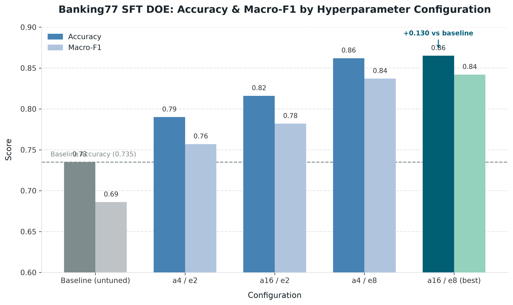
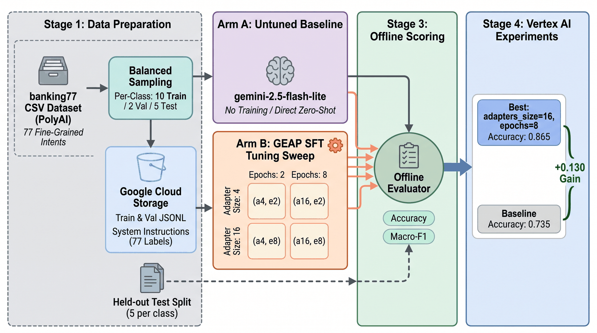

# Executive Report — Banking77 SFT Design of Experiments

**Prepared:** 2026-07-30 · **Owner:** Jordan Totten · **Branch/PR:** `doe-banking77` ([PR #10](https://github.com/tottenjordan/geap-tuning/pull/10))
**Platform:** Gemini Enterprise Agent Platform (GEAP / Vertex AI) · **Base model:** `gemini-2.5-flash-lite`

---

## 1. Executive summary

We ran a controlled fine-tuning experiment to answer one question: **does supervised fine-tuning (SFT) measurably improve a Gemini model on a hard, real-world classification task, and which hyperparameters matter?**

The answer is **yes, decisively.** On the 77-intent **banking77** benchmark, SFT lifted top-line accuracy from an untuned baseline of **0.735 to 0.865** — a **+0.130 absolute gain (+17.7% relative)** — with **Macro-F1 rising even further, +0.156** (0.686 → 0.842). Every one of the four tuned configurations beat the baseline, and the configurations **separated cleanly** from one another, giving us a genuine signal about *how* to tune (unlike our earlier demo task, which saturated at a perfect 1.0 and taught us nothing).

**Bottom line for decision-makers:** fine-tuning `gemini-2.5-flash-lite` on a small, balanced, in-domain dataset is a high-return, low-cost lever for fine-grained intent classification. The number of training epochs is the dominant knob; adapter size is a secondary lever that mainly helps when training is short.

---

## 2. Results at a glance

| Configuration | Adapter size | Epochs | Accuracy | Macro-F1 | Δ Accuracy vs baseline |
|---|---:|---:|---:|---:|---:|
| **Baseline (untuned)** | — | — | 0.735 | 0.686 | — |
| a4 / e2 | 4 | 2 | 0.790 | 0.757 | +0.055 |
| a16 / e2 | 16 | 2 | 0.816 | 0.782 | +0.081 |
| a4 / e8 | 4 | 8 | 0.862 | 0.837 | +0.127 |
| **a16 / e8 (best)** | 16 | 8 | **0.865** | **0.842** | **+0.130** |

All five runs are logged to Vertex AI Experiments (`geap-doe-banking77`) and readable side-by-side in Agent Platform Studio → Experiments.

---

## 3. What we tested (methodology)

- **Task & data.** banking77 (PolyAI/banking77, CC-BY-4.0) — 77 fine-grained banking customer-service intents. We sampled a **balanced** subset (per class: 10 train / 2 val / 5 test → 770 / 154 / 385 examples) and wrote standard SFT records that all share one system instruction listing the 77 candidate labels, so the untuned baseline and the tuned models are judged on equal footing.
- **Design.** A **2×2 full-factorial** grid crossing **epochs ∈ {2, 8}** with **adapter_size ∈ {4, 16}** = 4 SFT tuning jobs, **plus an untuned baseline** ("before") = 5 evaluated conditions.
- **Scoring.** Every model — baseline and all four tuned endpoints — is scored **offline on the same held-out test split**, reporting **Accuracy** and **Macro-F1** (Macro-F1 weights all 77 intents equally, so it exposes tail-class performance).
- **Rigor & cost control.** Tuning jobs are **idempotent by name** (re-runs reuse finished jobs, no re-spend); sampling is fixed-seed and reproducible; the baseline is a true zero-training reference.

---

## 4. What the experiment tells us

**Finding 1 — Fine-tuning works, and the gain is real, not saturation.** Every tuned cell beats the baseline, and the cells differ from each other. This is the discriminating signal our previous 5-intent demo lacked (it scored a useless 1.0 everywhere).

**Finding 2 — Epochs are the dominant lever.** Averaged across adapter sizes, going from 2→8 epochs adds **+0.061 accuracy**, versus **+0.015** for quadrupling adapter size (4→16). Training longer matters roughly **4× more** than a bigger adapter here.

**Finding 3 — Adapter size only helps when training is short (interaction effect).** At 2 epochs, a bigger adapter buys +0.026 accuracy; at 8 epochs it buys just +0.003. Once the model trains long enough, the small adapter has already captured the task — extra adapter capacity is nearly free performance you don't need.

**Finding 4 — Tuning helps the hard, minority intents most.** Macro-F1 improved **more** than accuracy (+0.156 vs +0.130), meaning the gains are not just on common intents — fine-tuning disproportionately fixed the rare, easily-confused ones, which is exactly what matters in 77-way classification.

---

## 5. Recommendation

- **For maximum quality:** `adapter_size=16, epochs=8` (accuracy **0.865**).
- **For best cost/quality trade-off:** `adapter_size=4, epochs=8` reaches **0.862** — within **0.003** of the best — at a smaller adapter. Prefer this as the default production recipe.
- **Tuning strategy going forward:** invest budget in **epochs first**; only raise adapter size if the epoch budget is constrained. The next experiment worth running is pushing epochs further (e.g. 8 → 12–16) to find where accuracy plateaus, since epochs are still on the steep part of the curve.

---

## 6. Reproduce / drill down

- **Driver:** `examples/run_doe_banking77.py` — `uv run --group viz python examples/run_doe_banking77.py` (idempotent; reuses the tuning jobs, re-scores, redraws the chart).
- **Notebook:** `notebooks/14_doe_banking77.ipynb` (thin walkthrough).
- **Zero-cost read-back:** `uv run --group viz python examples/run_multi_run_viz.py --experiment geap-doe-banking77`.
- **Dataset & method notes:** [`docs/notes/banking77-dataset.md`](../notes/banking77-dataset.md), [`docs/notes/doe-and-visualization.md`](../notes/doe-and-visualization.md).

*Figures generated with the PaperBanana MCP tool from the results above; source PNGs optimized (~1800px, 256-color) before committing.*
